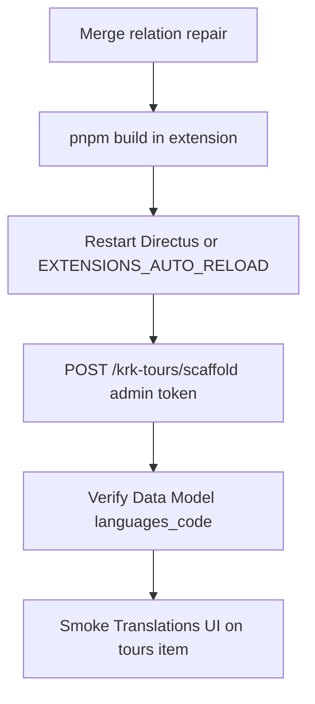

# krk-tours: `languages_code` relation repair & deploy

## Problem (fixed in extension v1.0.1+)

Directus auto-creates an M2O relation when translation collections are created with `foreign_key_table: languages`, often defaulting **`foreign_key_column` to `id`**. The `languages` collection uses **`code`** as its primary key. Older scaffold versions skipped existing `directus_relations` rows, so the wrong mapping persisted until an editor fixed **Related Field → Code** in Data Model.

**v1.0.1+** runs `ensureOrRepairRelations` on every `POST /krk-tours/scaffold` and reports `relationsRepaired` / `relationsUnchanged` in the response summary.

Affected fields:

- `tours_translations.languages_code`
- `tour_steps_translations.languages_code`

Expected (in `src/scaffold/directus-state-data.ts`):

- `schema.foreign_key_column: 'code'`
- `meta.junction_field`: `tours_id` / `tour_steps_id` respectively
- Parent translation alias: `junction_field: 'languages_code'` on `tours_id` / `tour_steps_id` relations

## Implementation (shipped)

Relation repair lives in `src/scaffold/relation-helpers.ts`:

- `readRelationRow` — reads `directus_relations` + Postgres `information_schema` FK targets (Directus 12+)
- `relationNeedsRepair` — pure compare (unit-tested)
- `ensureOrRepairRelations` — create, repair via `RelationsService.updateOne`, or skip

Unit tests: `tests/unit/relation-needs-repair.test.ts` (`pnpm test`).

## Code changes

### 1. Relation repair in `relation-helpers.ts` _(done)_

Replace “skip if exists” with **ensure or repair**:

1. Load existing row from `directus_relations` (`many_collection`, `many_field`) including relation `id` and stored schema/meta (via Knex or `RelationsService.readOne` if available).
2. Compare to desired payload from `directus-state-data.ts` (normalize: ignore `constraint_name: null`).
3. If missing → `createOne` (current behaviour).
4. If present but **mismatch** on any of:
   - `related_collection`
   - `schema.foreign_key_column`
   - `schema.foreign_key_table`
   - `meta.junction_field`
   - `meta.one_field` (for parent FK relations)
   → `updateOne(id, repairedPayload)` (extend `RelationsServiceLike` with `readOne` / `updateOne` as needed).
5. Log `repaired` vs `created` vs `unchanged`; expose counts on `ScaffoldSummary` (`relationsRepaired`, `relationsUnchanged`).

Apply repair for **all** relations in state, not only `languages_code` (cheap idempotent pass).

### 2. Optional prevention on fresh installs

When creating new collections via `CollectionsService.createOne`, omit `foreign_key_table` / `foreign_key_column` on `languages_code` field payloads in the **initial** field bundle (FK applied only via `RelationsService`). Keeps auto-relation from winning. Still run repair pass after fields exist.

Alternative: keep field FK hints for DB constraints but always run repair pass after collection create (simpler, one code path).

### 3. Field metadata alignment

Ensure `languages_code` field rows match push-notification pattern (hidden, no wrong interface). Optional: add `special: ['m2o']` only if Directus 12 requires it for Data Model (verify in Studio after repair).

### 4. Tests

- **Unit** (`tests/unit/relation-helpers.test.ts` or Vitest in extension): pure function `relationNeedsRepair(existing, desired)` with cases for wrong `foreign_key_column`, correct match, missing relation.
- **Integration** (follow-up): after scaffold against test DB, assert `directus_relations` + `directus_fields` for both translation collections (mirror push `schema-validation.spec.ts`).

### 5. Docs & version _(done — v1.0.1)_

## Deploy (local / staging / production)



1. **Build extension** (from `extensions/directus-extension-krk-tours/`):
   - `pnpm install`
   - `pnpm build` (runs `sync-state.ts` + `copy-state.js` into `dist/`)
2. **Deploy artifact**: `dist/api.js`, `dist/app.js`, `dist/directus-state.json` loaded via `extensions/` volume (see repo `docker-compose.yml`).
3. **Restart** Directus (recommended; auto-reload may not re-run hooks logic you only trigger via endpoint).
4. **Repair existing DB** (collections already present):
   ```bash
   curl -X POST "$PUBLIC_URL/krk-tours/scaffold" \
     -H "Authorization: Bearer <admin-token>"
   ```
   Check response `summary.relationsRepaired` (new field).
5. **Verify in Admin**
   - Settings → Data Model → `tours_translations` → `languages_code`: Related collection `languages`, Related field **Code** (`code`).
   - Same for `tour_steps_translations`.
   - Open a tour → Translations interface loads without relationship errors.
6. **API smoke**
   ```http
   GET /items/tours?fields=*,translations.*
   ```
   Translations should return `languages_code: "fi-FI"` (or your locale), not broken nested relations.

**Note:** First-boot hook only auto-scaffolds when `tours` is missing; **existing instances always need step 4** after deploying the fixed extension.

## M2M `tours.regions` / uuid junction (v1.0.2+)

### Problem

- `tours_places_regions.places_regions_id` must be **uuid** FK → `places_regions.id` (Krakovan Opas uses uuid region ids).
- Earlier scaffolds used **integer** for `places_regions_id` and sometimes **no** `directus_relations` row for that field → Regions `list-m2m` fails in Studio.

### Greenfield behaviour

1. Scaffold asserts `places_regions.id` type is `uuid` (`information_schema`).
2. Junction collection is created with **uuid** columns; FK hints on `tours_id` / `places_regions_id` are omitted on initial field create (`scaffold-field-payload.ts`) so `RelationsService` applies both M2M legs.
3. After relations, `validateToursRegionsJunctionRelations` fails scaffold if either leg is missing.

### Existing databases

- Manual: alter `places_regions_id` to uuid + configure M2O in Data Model (see plan / README).
- Re-scaffold **does not** change column types when `tours_places_regions` already exists.

## Rollback

If `updateOne` causes issues, restore previous extension `dist/` from git tag and re-run scaffold (repair logic absent; manual Data Model fix again).

## Out of scope

- Migrating translation PK strategy (integer vs uuid).
- Frontend krk-app changes (unaffected if API already works after manual fix).
